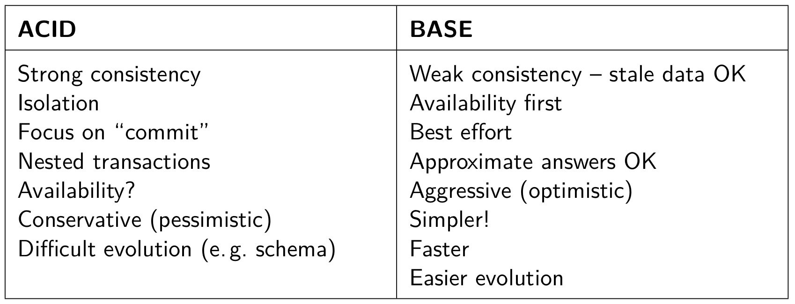

# The Development and Application of Hadoop and NoSQL 

## Aarti Parupudi, Quan Kong, Wenbo Wang

### 1. Abstract

### 2. Introduction

### 3. Review of Related Work

#### 3.1 Review on Hadoop

* [MapReduce: Simplified Data Processing on Large Clusters](https://www.usenix.org/legacy/publications/library/proceedings/osdi04/tech/full_papers/dean/dean_html/index.html) (Quan)
* [Understanding the Power of Hadoop as a Service](https://docs.google.com/file/d/0BwMVEMCs7KRNNWIyT3hiRXhLWms/edit) (Aarti)
* [The Hadoop Distributed File System](https://docs.google.com/file/d/0B2_4GOBGjarzTkdLZDBNbVdYTXM/edit) (Quan)

#### 3.2 Review on NoSQL

* [NoSQL Databases: a step to databases scalability in web environment](https://docs.google.com/file/d/0B2_4GOBGjarzckFhYmxkODNkVUE/edit) (Mac)
* [NoSQL Databases](https://docs.google.com/file/d/0B2_4GOBGjarzaTdjcFhoODZVQWs/edit) (Mac)
* [A Comparison Between Several NoSQL Databases](https://docs.google.com/file/d/0B2_4GOBGjarzdnpWUk1GQjFndU0/edit?usp=drive_web) (Mac)

---

* Connections Between Papers
	* The first paper aims to focus on NoSQL databases in the context of cloud computing, talking about the origin and necessity of NoSQL movement. Then the second paper broadens the surface of study and introduces the details in NoSQL techniques, including the several data models and their applicable platforms. Then the third paper conducts a comparison between them and list their advantages and drawbacks. 

* **The Definition of NoSQL**: A NoSQL (often interpreted as Not Only SQL) database provides a mechanism for storage and retrieval of data that is modeled in means other than the tabular relations used in relational databases.

* **A Little History**: The term NoSQL was first used in 1998 for a relational database that omitted the use of SQL. The term was picked up again in 2009 and used for conferences of advocates of non-relational databases. A blogger, often referred to as having made the term popular is Rackspace employee Eric Evans who later described the ambition of the NoSQL movement as “the whole point of seeking alternatives is that you need to solve a problem that relational databases are a bad fit for”. 

* **Motivation of NoSQL**: 
	* Avoidance of Unneeded Complexity;
	* High Throughput;
	* Horizontal Scalability and Running on Commodity Hardware;
	* Avoidance of Expensive Object-Relational Mapping;
	* Complexity and Cost of Setting up Database Clusters;
	* Compromising Reliability for Better Performance;
	* The current "One size fit's it all" Databases Thinking Was and Is Wrong;
	* The Myth of Effortless Distribution and Partitioning of Centralized Data Models;
	* Movements in Programming and Languages and Development Frameworks;
	* Requirements of Cloud Computing;
	* The RDBMS plus Caching-Layer Pattern/Workaround vs. Systems Built from Scratch with Scalability in Mind;
	* Yesterday's vs. Today's Needs;

* **Types of NoSQL databases**: this basic classification is based on data model. 
	* Column
	* Document
	* Key-value
	* Graph
	* Hybrid

* CAP-Theorem
	* **Consistency**: meaning if and how a system is in a consistent state after the execution of an operation. A distributed system is typically considered to be consistent if after an update operation of some writer all readers see his updates in some shared data source.
	* **Availability**: and especially high availability meaning that a system is designed and implemented in a way that allows it to continue operation (i.e. allowing read and write operations) if e.g. nodes in a cluster crash or some hardware or software parts are down due to upgrades.
	* **Partition Tolerance**: understood as the ability of the system to continue operation in the presence of network partitions. These occur if two or more “islands” of network nodes arise which (temporarily or permanently) cannot connect to each other. Some people also understand partition tolerance as the ability of a system to cope with the dynamic addition and removal of nodes.
	* CAP-Theorem - Alternatives, Traits, Examples

	* The CAP Theorem states, that for any system sharing data it is impossible to guarantee simultaneously all of these three properties. 
		* Particularly, in web applications based on horizontal scaling strategy it is necessary to decide between C and A. Usual DBMS prefer C over A and P. 

* ACID vs BASE
	* ACID
		* Atomicity
		* Consistency
		* Isolation
		* Durability
	* BASE
		* Basically Available
		* Soft-state
		* Eventual Consistency
	* 
	* BASE: an application work basically all the time (basically available), does not have to be consistent all the time (soft-state) but will be in some known-state state eventually (eventual consistency).

* Strict Consistency vs Eventual Consistency
	* Strict Consistency: according to Lipcon means that “All read operations must return data from the latest completed write operation, regardless of which replica the operations went to”. This implies that either read and write operations for a given dataset have to be executed on the same node2 or that strict consistency is assured by a distributed transaction protocol (like two-phase-commit or Paxos). As we have seen above, such a strict consistency cannot be achieved together with availability and partition tolerance according to the CAP-theorem.
	* Eventual Consistency: means that readers will see writes, as time goes on: “In a steady state, the system will eventually return the last written value”. Clients therefore may face an inconsistent state of data as updates are in progress. For instance, in a replicated database updates may go to one node which replicates the latest version to all other nodes that contain a replica of the modified dataset so that the replica nodes eventually will have the latest version.

* 

		

#### 3.3 Review on Hadoop + NoSQL

* [Integrating MapReduce and RDBMSs](https://docs.google.com/file/d/0B2_4GOBGjarzS09UbV8tTkR2ems/edit) (Quan)
* [Optimizing Your Enterprise Architecture with Apache Hadoop and NoSQL](https://docs.google.com/file/d/0BwMVEMCs7KRNTjBCSzVQZ0E3OXc/edit) (Aarti)
* [SQL-on-Hadoop Engines Explained](https://docs.google.com/file/d/0BwMVEMCs7KRNb1hici14RV9XVnc/edit) (Aarti)
* [Hadoop and NoSQL Technologies and the Oracle Database](https://docs.google.com/file/d/0BwMVEMCs7KRNUDJwaWx2Y2VyXzA/edit) (Mac)

### 4. Conclusion

### 5. Future Work